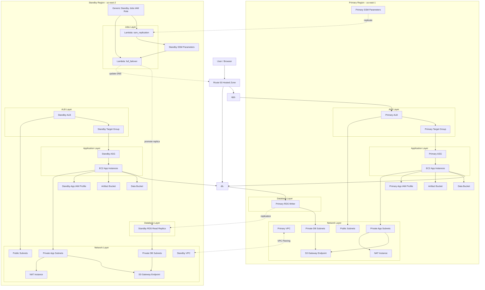

# terraform-aws-multi-region-ha

A portfolio infrastructure project that provisions a layered AWS environment with:

- primary and standby regions
- custom VPC networking
- ALBs and Auto Scaling Groups
- primary and standby PostgreSQL database setup
- Route 53 DNS
- S3-backed application delivery
- S3 VPC endpoints for private access
- Lambda-based operational jobs for SSM replication and full failover

This project is designed as a learning and portfolio platform, not as a production-ready reference implementation.

## Architecture Diagram

## Architecture Summary

The stack is split into independent Terraform layers. Each layer owns one concern and publishes important values into SSM Parameter Store for downstream layers.

### Regions

- Primary region: `us-east-1`
- Standby region: `us-east-2`

### DNS

- `app.<domain>` points to the active application ALB
- `db.<domain>` points to the active database endpoint

The current design supports manual full failover through a Lambda job after standby configuration has been replicated into standby-region SSM.

## Layers

### `bootstrap/`

Creates the shared backend resources used by the rest of the project:

- Terraform state S3 bucket
- Terraform lock table

### `network-layer/`

Creates foundational networking in both regions:

- primary and standby VPCs
- public and private subnets across two AZs per region
- IGWs
- NAT instances
- route tables and associations
- security groups
- VPC peering
- S3 gateway endpoints

Publishes network discovery values into SSM.

### `iam-layer/`

Creates IAM roles and instance profiles for the application EC2 instances and publishes the instance profile names to SSM.

### `alb-layer/`

Creates:

- primary and standby ALBs
- target groups
- listeners

Publishes target group ARNs and ALB DNS names to SSM.

### `database-layer/`

Creates:

- primary PostgreSQL RDS instance
- standby cross-region read replica
- DB subnet groups

Publishes DB instance IDs, endpoints, ports, and ARNs to SSM.

### `route53-layer/`

Creates:

- public Route 53 hosted zone
- `app` CNAME
- `db` CNAME

Publishes hosted zone ID and record FQDNs to SSM.

### `storage-layer/`

Creates:

- primary and standby S3 artifact buckets
- primary and standby S3 data buckets
- application artifact object upload

Publishes bucket names, ARNs, and the application artifact key to SSM.

### `application-layer/`

Creates:

- primary and standby launch templates
- primary and standby Auto Scaling Groups

Instances bootstrap from S3, download the application artifact, and run the dashboard app with `systemd`.

### `jobs-layer/`

Creates two operational Lambda jobs in the standby region:

- `ssm_replication`
  - copies project SSM parameters from primary region into standby region using the exact same names and paths
- `full_failover`
  - reads standby-region SSM
  - validates standby app and DB
  - promotes the standby DB replica
  - updates DB Route 53 record
  - updates app Route 53 record
  - writes failover state into standby SSM

## Application

The deployed application is a lightweight Python dashboard that shows:

- region and availability zone
- instance metadata
- DB connectivity status
- S3 private-access status
- live payload/health data

Routes:

- `/` renders the HTML dashboard
- `/health` returns JSON health output

## SSM Strategy

The project uses SSM Parameter Store as the layer integration mechanism.

### Primary region SSM

Producer layers write infrastructure discovery values to primary-region SSM.

### Standby region SSM

The `ssm_replication` Lambda copies the project namespace from primary to standby with the same parameter names so the failover Lambda can operate entirely from standby-region SSM.

### Standby failover state

The jobs layer also keeps runtime failover state in standby-region SSM, including:

- active app region
- active DB region
- last status
- last timestamp
- operation lock

## Apply Order

Recommended apply order:

1. `bootstrap`
2. `network-layer`
3. `iam-layer`
4. `alb-layer`
5. `database-layer`
6. `route53-layer`
7. `storage-layer`
8. `application-layer`
9. `jobs-layer`

After `jobs-layer` is applied, invoke the `ssm_replication` Lambda once so standby-region SSM is populated before using the failover Lambda.

## Destroy Order

Recommended destroy order:

1. `application-layer`
2. `route53-layer`
3. `alb-layer`
4. `iam-layer`
5. `storage-layer`
6. `database-layer`
7. `jobs-layer`
8. `network-layer`

Destroy `bootstrap` only if you also want to remove the shared Terraform backend resources.

## Full Failover Flow

Current full failover flow:

1. Confirm standby app is healthy
2. Confirm standby DB replica is healthy
3. Promote standby DB replica
4. Wait for DB promotion to finish
5. Update `db.<domain>` to standby DB
6. Update `app.<domain>` to standby ALB
7. Validate standby application health
8. Record failover state in standby SSM

This is currently a manual operational action initiated through Lambda, not an automated monitoring-driven failover.

## Health Checks

Health path has been aligned to:

- application: `/health`
- ALB health check: `/health`
- failover validation: `/health`

The dashboard root path remains `/`.

## Variable Notes

### `project_name`

`project_name` is validated at the layer level and must use:

- lowercase letters
- numbers
- hyphens

This is important because the value is used in:

- resource names
- SSM paths
- S3 naming patterns
- Linux service/runtime naming derived in the application layer

### `domain_name`

The Route 53 domain is set in `route53-layer/terraform.tfvars`.

Changing it is supported by configuration, but operationally it still requires:

- Route 53 reapply
- registrar NS update if the hosted zone changes
- SSM replication rerun
- application instance refresh so new DB FQDN is baked into userdata-derived env files

## Known Tradeoffs

This project intentionally favors clarity and breadth over full production hardening.

Current tradeoffs include:

- manual failover instead of fully automated failover
- SSM-based loose coupling between layers
- NAT instances rather than NAT gateways
- standby region preprovisioned but not active-active
- Route 53 CNAME-based cutover rather than advanced traffic steering
- backend settings are intentionally tied to one bootstrap-managed backend

## Validation Status

The project has been checked with Terraform validation across the active layers after the recent changes:

- standby region alignment to `us-east-2`
- `/health` consistency
- configurable application packaging paths
- layer-level `project_name` validation

## Repository Goal

This repository is best presented as:

> A layered multi-region AWS infrastructure portfolio project built with Terraform, demonstrating network design, regional application deployment, Route 53 DNS cutover, S3-backed application delivery, and Lambda-based operational failover jobs.
